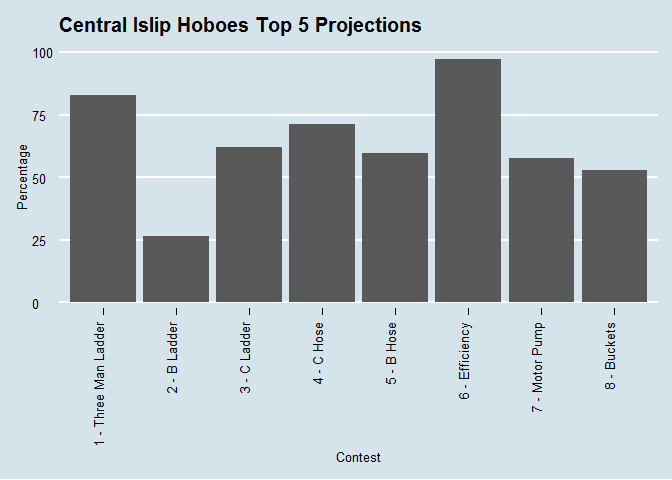
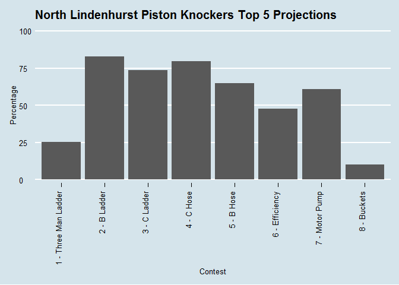
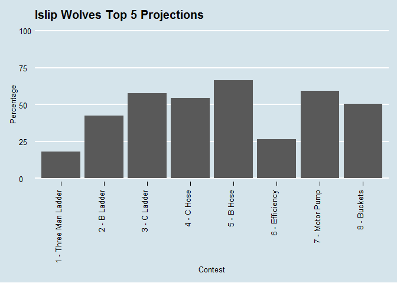
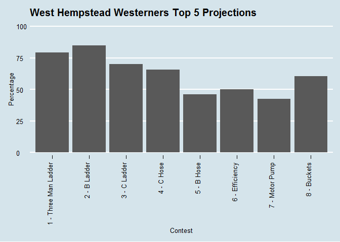

DataViz
================
Dan Murphy
August 17, 2016

Shown below is the code and resulting data vizualizations used in communicating the 2016 projections. The images were published [here](https://patindex.wordpress.com/2016-odds/)

First, the dataset is manipulated to vectorize the results.

``` r
SimTally.LongFirst <- gather(SimTally,ContestFirst,FirstPct,c(4,7,10,13,16,19,22,26,28))
SimTally.LongTop5 <- gather(SimTally,ContestTop5,Top5Pct,c(5,8,11,14,17,20,23,27,29))

Results <- bind_cols(select(SimTally.LongFirst, 1,2,21,22), select(SimTally.LongTop5, 21,22))

remove(SimTally.LongFirst,SimTally.LongTop5)
```

Here, the ggthemes package is loaded and a bar graph of the teams with a chance for first place is created.

``` r
library(ggthemes)
```

    ## Warning: package 'ggthemes' was built under R version 3.2.5

``` r
ggplot(Results %>% filter(ContestFirst=="OverallFirstPlace" & FirstPct > 0), aes(x=Team,y=FirstPct)) + 
  geom_bar(stat = "identity") + theme_economist() + scale_colour_economist()  + 
      ggtitle("Projections for First Place") +
      labs(x="Team", y="Percentage") + 
      theme(axis.text.x = element_text(angle = 90, hjust = 1))
```

<!-- -->

And the chances for Top 5.

``` r
library(ggthemes)

ggplot(Results %>% filter(ContestTop5=="OverallTop5" & Top5Pct > 0), aes(x=Team,y=Top5Pct)) + 
  geom_bar(stat = "identity") + theme_economist() + scale_colour_economist()  + 
      ggtitle("Projections for Top 5") +
      labs(x="Team", y="Percentage") + 
      theme(axis.text.x = element_text(angle = 90, hjust = 1))
```

<!-- -->

Before the next set of charts, an adjustment is made to the Contest columns to use simpler labels

``` r
Results$ContestFirst <- ifelse(Results$ContestFirst=="BLadderFirstPlace","2 - B Ladder",Results$ContestFirst)
Results$ContestFirst <- ifelse(Results$ContestFirst=="CLadderFirstPlace","3 - C Ladder",Results$ContestFirst)
Results$ContestFirst <- ifelse(Results$ContestFirst=="CHoseFirstPlace","4 - C Hose",Results$ContestFirst)
Results$ContestFirst <- ifelse(Results$ContestFirst=="BHoseFirstPlace","5 - B Hose",Results$ContestFirst)
Results$ContestFirst <- ifelse(Results$ContestFirst=="EfficiencyFirstPlace", 
                                                     "6 - Efficiency",Results$ContestFirst)
Results$ContestFirst <- ifelse(Results$ContestFirst=="MotorPumpFirstPlace",
                                                     "7 - Motor Pump",Results$ContestFirst)
Results$ContestFirst <- ifelse(Results$ContestFirst=="BucketsFirstPlace","8 - Buckets",Results$ContestFirst)
Results$ContestFirst <- ifelse(Results$ContestFirst=="ThreeManLadderFirstPlace",
                                                     "1 - Three Man Ladder",Results$ContestFirst)
Results$ContestFirst <- ifelse(Results$ContestFirst=="OverallFirstPlace",
                                                     "Overall",Results$ContestFirst)

Results$ContestTop5 <- ifelse(Results$ContestTop5=="BLadderTop5","2 - B Ladder",Results$ContestTop5)
Results$ContestTop5 <- ifelse(Results$ContestTop5=="CLadderTop5","3 - C Ladder",Results$ContestTop5)
Results$ContestTop5 <- ifelse(Results$ContestTop5=="CHoseTop5","4 - C Hose",Results$ContestTop5)
Results$ContestTop5 <- ifelse(Results$ContestTop5=="BHoseTop5","5 - B Hose",Results$ContestTop5)
Results$ContestTop5 <- ifelse(Results$ContestTop5=="EfficiencyTop5", 
                                                     "6 - Efficiency",Results$ContestTop5)
Results$ContestTop5 <- ifelse(Results$ContestTop5=="MotorPumpTop5",
                                                     "7 - Motor Pump",Results$ContestTop5)
Results$ContestTop5 <- ifelse(Results$ContestTop5=="BucketsTop5","8 - Buckets",Results$ContestTop5)
Results$ContestTop5 <- ifelse(Results$ContestTop5=="ThreeManLadderTop5",
                                                     "1 - Three Man Ladder",Results$ContestTop5)
Results$ContestTop5 <- ifelse(Results$ContestTop5=="OverallTop5",
                                                     "Overall",Results$ContestTop5)
```

Next, we'll look at the contest breakdown for each team with a chance for first.

``` r
ggplot(Results %>% filter(Team == "Central Islip Hoboes" & ContestTop5 != "Overall"),
       aes(x=ContestTop5,y=Top5Pct)) + geom_bar(stat = "identity") + 
       theme_economist() + scale_colour_economist()  + ggtitle("Central Islip Hoboes Top 5 Projections") +
       labs(x="Contest", y="Percentage") + theme(axis.text.x = element_text(angle = 90, hjust = 1))
```

<!-- -->

``` r
ggplot(Results %>% filter(Team == "West Sayville Flying Dutchmen" & ContestTop5 != "Overall"),
       aes(x=ContestTop5,y=Top5Pct)) + geom_bar(stat = "identity") + 
       theme_economist() + scale_colour_economist()  + 
       ggtitle("West Sayville Flying Dutchmen Top 5 Projections") +
       labs(x="Contest", y="Percentage") + theme(axis.text.x = element_text(angle = 90, hjust = 1))
```

<!-- -->

``` r
ggplot(Results %>% filter(Team == "North Lindenhurst Piston Knockers" & ContestTop5 != "Overall"),
       aes(x=ContestTop5,y=Top5Pct)) + geom_bar(stat = "identity") + 
       theme_economist() + scale_colour_economist()  + 
       ggtitle("North Lindenhurst Piston Knockers Top 5 Projections") +
       labs(x="Contest", y="Percentage") + theme(axis.text.x = element_text(angle = 90, hjust = 1))
```

<!-- -->

``` r
ggplot(Results %>% filter(Team == "Islip Wolves" & ContestTop5 != "Overall"),
       aes(x=ContestTop5,y=Top5Pct)) + geom_bar(stat = "identity") + 
       theme_economist() + scale_colour_economist()  + 
       ggtitle("Islip Wolves Top 5 Projections") +
       labs(x="Contest", y="Percentage") + theme(axis.text.x = element_text(angle = 90, hjust = 1))
```

<!-- -->

``` r
ggplot(Results %>% filter(Team == "West Hempstead Westerners" & ContestTop5 != "Overall"),
       aes(x=ContestTop5,y=Top5Pct)) + geom_bar(stat = "identity") + 
       theme_economist() + scale_colour_economist()  + 
       ggtitle("West Hempstead Westerners Top 5 Projections") +
       labs(x="Contest", y="Percentage") + theme(axis.text.x = element_text(angle = 90, hjust = 1))
```

<!-- -->

``` r
ggplot(Results %>% filter(Team == "Port Washington Road Runners" & ContestTop5 != "Overall"),
       aes(x=ContestTop5,y=Top5Pct)) + geom_bar(stat = "identity") + 
       theme_economist() + scale_colour_economist()  + 
       ggtitle("Port Washington Road Runners Top 5 Projections") +
       labs(x="Contest", y="Percentage") + theme(axis.text.x = element_text(angle = 90, hjust = 1))
```

<!-- -->

``` r
ggplot(Results %>% filter(Team == "Bay Shore Redskins" & ContestTop5 != "Overall"),
       aes(x=ContestTop5,y=Top5Pct)) + geom_bar(stat = "identity") + 
       theme_economist() + scale_colour_economist()  + 
       ggtitle("Bay Shore Redskins Top 5 Projections") +
       labs(x="Contest", y="Percentage") + theme(axis.text.x = element_text(angle = 90, hjust = 1))
```

<!-- -->

``` r
ggplot(Results %>% filter(Team == "Copiague Yellowbirds" & ContestTop5 != "Overall"),
       aes(x=ContestTop5,y=Top5Pct)) + geom_bar(stat = "identity") + 
       theme_economist() + scale_colour_economist()  + 
       ggtitle("Copiague Yellowbirds Top 5 Projections") +
       labs(x="Contest", y="Percentage") + theme(axis.text.x = element_text(angle = 90, hjust = 1))
```

<!-- -->
